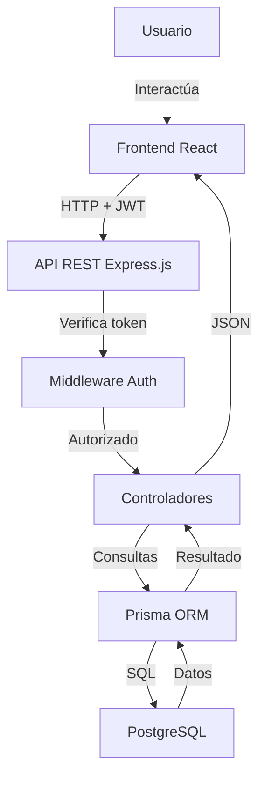

# Arquitectura del Sistema

## Tipo de arquitectura

El sistema utiliza una arquitectura **cliente-servidor** con patrón **MVC (Modelo-Vista-Controlador)** en el backend.

---

## Componentes principales

### Frontend (Cliente)
- Desarrollado en **React**
- Se ejecuta en el navegador del usuario
- Consume la API REST del backend mediante **axios**
- Maneja autenticación con tokens JWT almacenados en localStorage
- Rutas protegidas que redirigen al login si no hay sesión activa

### Backend (Servidor)
- Desarrollado en **Node.js + Express.js**
- Expone una API REST con endpoints organizados por módulo
- Arquitectura MVC:
  - **Rutas:** definen los endpoints disponibles
  - **Controladores:** contienen la lógica de cada operación
  - **Middlewares:** verifican autenticación y permisos
- Genera y valida tokens **JWT** para autenticación

### Base de datos
- Motor: **PostgreSQL**
- ORM: **Prisma**
- Gestiona la persistencia de usuarios, retos, soluciones, comentarios y evaluaciones

---

## Comunicación entre componentes

Usuario
↓
Navegador (React)
↓ HTTP requests con JWT en headers
API REST (Express.js)
↓ Verifica token → Controlador → Prisma ORM
Base de datos (PostgreSQL)

1. El usuario interactúa con la interfaz React
2. React envía peticiones HTTP a la API usando axios
3. El middleware verifica el token JWT
4. El controlador procesa la lógica y consulta la base de datos mediante Prisma
5. La respuesta regresa en formato JSON al frontend
6. React actualiza la interfaz con los datos recibidos

---

## Diagrama de arquitectura

---

## Estructura del proyecto

cibersec-platform/
├── backend/
│   ├── src/
│   │   ├── routes/          # Definición de endpoints
│   │   ├── controllers/     # Lógica de negocio
│   │   ├── middlewares/     # Autenticación y permisos
│   │   └── config/          # Configuración de Prisma
│   └── prisma/
│       └── schema.prisma    # Modelo de base de datos
└── frontend/
└── src/
├── pages/           # Vistas principales
├── components/      # Componentes reutilizables
├── services/        # Comunicación con la API
└── context/         # Estado global de autenticación
